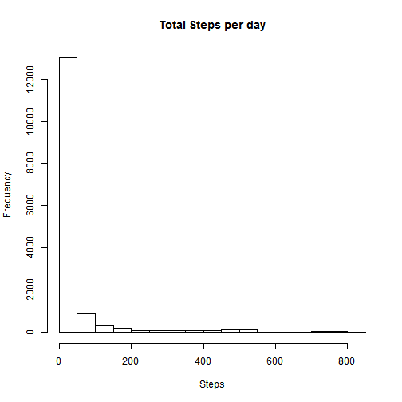
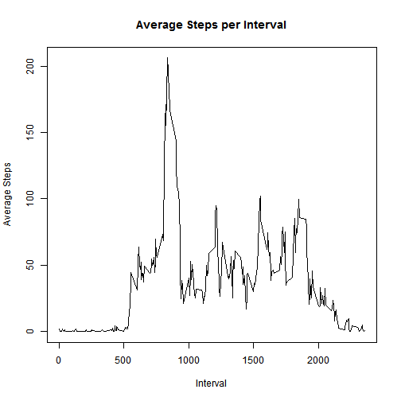
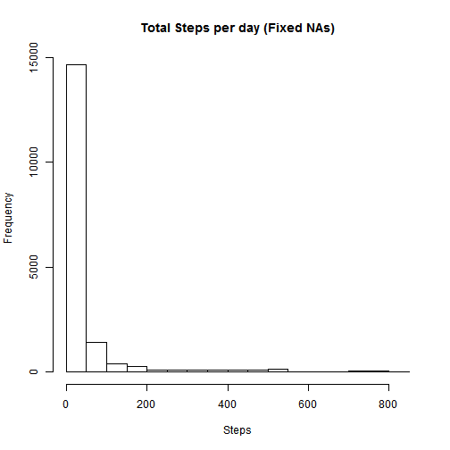
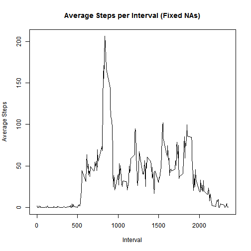
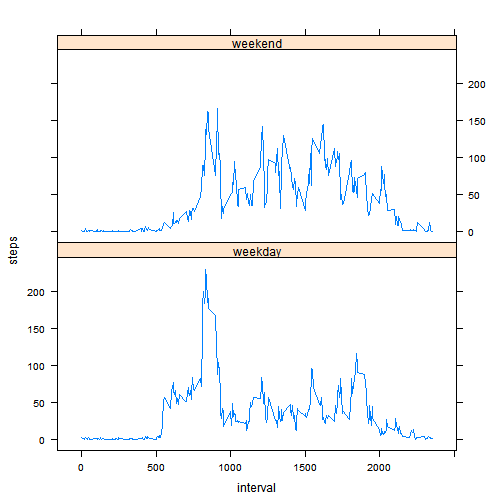

 Load the data from the downloaded .CSV file.  
 Ensure that the file is in the working folder of this session

```r
activity_data <- read.csv('activity.csv')
```

Show total number of steps

```r
sum(activity_data$steps, na.rm = TRUE)
```

```
## [1] 570608
```

Plot histogram of the total steps taken per day, ignoring missing values in the dataset.  
The histogram will ignore NAs

```r
hist(activity_data$steps,xlab="Steps",ylab="Frequency",main="Total Steps per day")
```

 

Report the mean and median of the total number of steps taken per day

```r
median(activity_data$steps, na.rm = TRUE)
```

```
## [1] 0
```

```r
mean(activity_data$steps, na.rm = TRUE)
```

```
## [1] 37.3826
```
 
What is the average daily activity pattern?  
Create aggregate with mean of steps by Interval

```r
av_dat <- aggregate(steps ~ interval, activity_data, mean)
```

Plot a time series, type line of Interval by average number of steps across all days

```r
plot(av_dat$interval,av_dat$steps,type='l',xlab="Interval",ylab="Average Steps",main="Average Steps per Interval")
```

 

Find Interval with the maximum avearge steps

```r
av_dat[which.max(av_dat$steps),]
```

```
##     interval    steps
## 104      835 206.1698
```


```r
av_dat[which.max(av_dat$steps),]$interval
```

```
## [1] 835
```

###Filling in the missing NA values 

The strategy will be that each NA value will be filled with the mean value for all the days for that time Interval
 
Separate the NA rows

```r
na_dat <- activity_data[is.na(activity_data$steps), ]
```

Create dataframe containing NA rows with a replacement value which is the average for the Interval

```r
na_merge <- merge(na_dat,av_dat, by.x = "interval",by.y = "interval")
```

Create new dataframe from na_merge with just the columns we want

```r
na_fixed <- na_merge[,c("steps.y","date","interval")]
```

Change the column name to steps ready for rbind

```r
colnames(na_fixed)[1] <- "steps"
```

Create a dataframe of just the not NA rows

```r
complete_dat <- activity_data[!is.na(activity_data$steps), ]
```

Bind the fixed NA rows back to the non-NA rows

```r
activity_fixed <- rbind(complete_dat,na_fixed)
```

Look at differences between the original and the NA-fixed version

```r
hist(activity_fixed$steps,xlab="Steps",ylab="Frequency",main="Total Steps per day (Fixed NAs)")
```

 

There is a differnce in the overall number of steps

```r
summary(activity_data$steps)
```

```
##    Min. 1st Qu.  Median    Mean 3rd Qu.    Max.    NA's 
##    0.00    0.00    0.00   37.38   12.00  806.00    2304
```


```r
summary(activity_fixed$steps)
```

```
##    Min. 1st Qu.  Median    Mean 3rd Qu.    Max. 
##    0.00    0.00    0.00   37.38   27.00  806.00
```

Mean and Max remain the same.  

Looking closer at the means:

```r
av_dat_fixed <- aggregate(steps ~ interval, activity_fixed, mean)
```


```r
plot(av_dat_fixed$interval,av_dat_fixed$steps,type='l',xlab="Interval",ylab="Average Steps",main="Average Steps per Interval (Fixed NAs)")
```

 


```r
av_dat[which.max(av_dat$steps),]
```

```
##     interval    steps
## 104      835 206.1698
```


```r
av_dat[which.max(av_dat_fixed$steps),]
```

```
##     interval    steps
## 104      835 206.1698
```

Since the NAs were filled with mean values there is no change to the means.  

 Comparing the total daily steps

```r
sum(activity_data$steps, na.rm = TRUE )
```

```
## [1] 570608
```

```r
sum(activity_fixed$steps, na.rm = TRUE )
```

```
## [1] 656737.5
```
### Weekday/weekend analysis


```r
install.packages("lubridate", repos="http://cran.rstudio.com/")
```

```
## Installing package into 'C:/Users/John/Documents/R/win-library/3.1'
## (as 'lib' is unspecified)
```

```
## package 'lubridate' successfully unpacked and MD5 sums checked
## 
## The downloaded binary packages are in
## 	C:\Users\John\AppData\Local\Temp\Rtmp6LP1rZ\downloaded_packages
```

```r
library(lubridate)
```

```
## Warning: package 'lubridate' was built under R version 3.1.3
```

Convert date column to a date class

```r
activity_fixed$date <- ymd(activity_fixed$date)
```
 
Convert date to day of week, determine if it is a weekend or weekday and make it a factor  
add the resultant as a new column weeday 

```r
activity_fixed$weekday <- as.factor(ifelse(wday(activity_fixed$date) %in% c("7", "1"), "weekend","weekday"))
```

Average the step by interval and weekday

```r
av_dat_fixed_wd <- aggregate(steps ~ interval + weekday, activity_fixed, mean)
```

Panel plot Interval and average steps by weekend/weekday

```r
library(lattice)
```


```r
xyplot(steps ~ interval | factor(weekday), data=av_dat_fixed_wd,type='l',layout=c(1,2))
```

 

--------------------- End of Document ---------------------------
